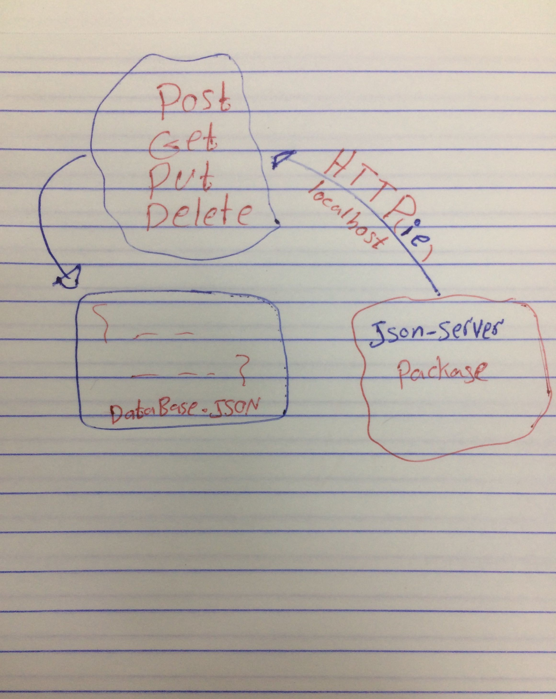

# 401-lab-06-simple-api

# LAB - Class 06

## HTTP and REST

### Author: obada al-quran

### Links and Resources

- [submission PR](http://xyz.com)
- [swagger hub pag](https://app.swaggerhub.com/apis/obadeh/api-test/0.1) (swagger hub pag)
- [docs](./docs/docs.json)(swagger api documentation)

### Setup

#### `.env` requirements (where applicable)

i.e.

- `PORT` - localhost/3000

#### How to initialize/run your application (where applicable)

- e.g. `json-server --id=_id --watch data/db.json --routes routes/routes.json`
- http `http POST/GET/DELETE/PUT`

#### UML

